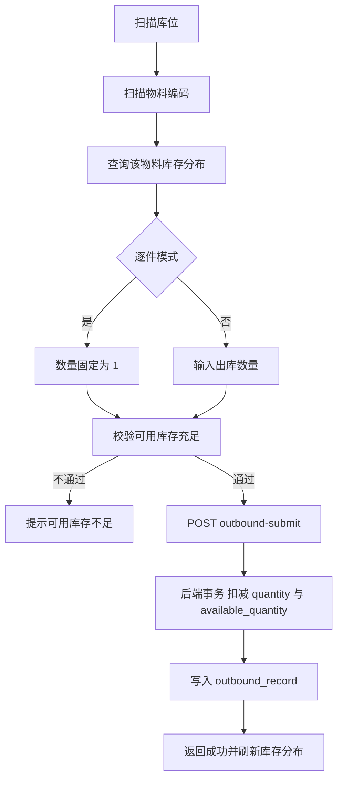

# 出库页面实现方案

## 一、背景与目标

参考移库页面 [`Relocation.vue`](../src/views/Relocation.vue) 的「物料移库」交互模式，新建出库页面，支持扫描库位与物料编码，逐件或批量扣减库存，并将出库操作写入记录（日志），另提供独立的历史出库记录查询页。

当前 [`Outbound.vue`](../src/views/Outbound.vue) 是占位符页面，需整体重写。

## 二、已确认的关键决策

1. **后端新增专用出库接口**（含出库记录/日志），前后端都改，不复用已有 `POST /inventory/update`。
2. **库存校验口径**：使用「可用数量 availableQuantity」，与移库页面保持一致。
3. **available_quantity 是普通列**：出库时需同时扣减 `quantity` 与 `available_quantity` 两个字段。
4. **出库记录**：后端落库，并新增独立的历史出库记录查询页面。

## 三、后端改动明细（server_wms）

### 3.1 新增实体

**`entity/OutboundRecord.java`**（出库记录）：

| 字段 | 类型 | 说明 |
|------|------|------|
| id | Integer | 主键 |
| orderNo | String | 出库单号，格式 `OB + yyyyMMddHHmmssSSS` |
| position | String | 库位 |
| ean | String | EAN 码（从库存记录获取） |
| material | String | 物料编码 |
| quantity | Integer | 出库数量 |
| operatorId | Integer | 操作员 ID（来自 ThreadLocalUtil） |
| operatorName | String | 操作员名称（来自 ThreadLocalUtil） |
| remark | String | 备注 |
| createTime | LocalDateTime | 创建时间 |

**`entity/OutboundRequest.java`**（出库请求体）：

| 字段 | 类型 | 说明 |
|------|------|------|
| position | String | 库位（必填） |
| material | String | 物料编码（必填） |
| quantity | Integer | 出库数量（必填，>0） |
| remark | String | 备注（可选） |

### 3.2 新增 DAO 与 Mapper

**`dao/IOutboundRecordDao.java`**：
- `int insert(OutboundRecord record)`：插入记录
- `List<OutboundRecord> selectAll()`：查询全部（按 `create_time` 倒序）

**`resources/mapper/OutboundRecordMapper.xml`**：
- 对应 insert / selectAll 两条 SQL，使用 resultMap 映射下划线字段。

### 3.3 扩展库存 DAO 与 Mapper

**`dao/IInventoryDao.java`** 新增：

```java
// 查询完整库存记录（含 ean、availableQuantity）
@Select("SELECT position, ean, material, quantity, block_quantity, available_quantity " +
        "FROM inventory WHERE position = #{position} AND material = #{material}")
Inventory selectFullByPositionMaterial(@Param("position") String position,
                                       @Param("material") String material);
```

**`resources/mapper/InventoryMapper.xml`** 新增扣减方法：

```xml
<update id="deductAvailableQuantity">
    UPDATE inventory
    SET quantity = quantity - #{quantity},
        available_quantity = available_quantity - #{quantity}
    WHERE position = #{position}
      AND material = #{material}
      AND available_quantity >= #{quantity}
</update>
```

对应 DAO 接口方法 `int deductAvailableQuantity(...)`，返回影响行数；为 0 表示库存不足或记录不存在。

> 说明：现有 `updateQuantities`（`POST /inventory/update`）只改 `quantity`，且校验用总库存，与本次口径不同，保持不动，避免影响既有批量出库接口。

### 3.4 新增 Service

**`service/IOutboundService.java`**：
- `OutboundRecord submit(OutboundRequest request)`：提交出库
- `List<OutboundRecord> list()`：查询出库记录

**`service/impl/OutboundServiceImpl.java`**（`@Transactional(rollbackFor = Exception.class)`）：
1. 通过 `selectFullByPositionMaterial` 查询该库位物料的库存记录，为空则抛「该库位无此物料的库存记录」。
2. 校验 `quantity <= availableQuantity`，不足则抛「可用库存不足」。
3. 调用 `deductAvailableQuantity` 扣减 `quantity` 与 `available_quantity`；影响行数为 0 则抛异常回滚。
4. 调用 `deleteZeroQuantity()` 清理数量归零的记录。
5. 从 `ThreadLocalUtil.get()` 取 `id` 与 `username` 填充操作员。
6. 组装 `OutboundRecord`（含 `orderNo`、`ean`）并 `insert`，返回记录。

### 3.5 新增 Controller

**`controller/OutboundController.java`**（`@RequestMapping("/outbound")`）：

| 方法 | 路径 | 说明 |
|------|------|------|
| POST | `/outbound/submit` | 提交出库，返回 `Result<OutboundRecord>` |
| GET | `/outbound/list` | 查询全部出库记录，返回 `Result<List<OutboundRecord>>` |

### 3.6 建表 SQL（供用户执行）

```sql
CREATE TABLE IF NOT EXISTS outbound_record (
  id INT PRIMARY KEY AUTO_INCREMENT,
  order_no VARCHAR(64) NOT NULL COMMENT '出库单号',
  position VARCHAR(64) NOT NULL COMMENT '库位',
  ean VARCHAR(64) DEFAULT NULL COMMENT 'EAN码',
  material VARCHAR(64) NOT NULL COMMENT '物料编码',
  quantity INT NOT NULL COMMENT '出库数量',
  operator_id INT DEFAULT NULL COMMENT '操作员ID',
  operator_name VARCHAR(64) DEFAULT NULL COMMENT '操作员名称',
  remark VARCHAR(255) DEFAULT NULL COMMENT '备注',
  create_time DATETIME DEFAULT CURRENT_TIMESTAMP COMMENT '创建时间',
  INDEX idx_order_no (order_no),
  INDEX idx_create_time (create_time)
) ENGINE=InnoDB DEFAULT CHARSET=utf8mb4 COMMENT='出库记录表';
```

## 四、前端改动明细（vue_wms）

### 4.1 扩展 [`src/api/outbound.ts`](../src/api/outbound.ts)

保留现有拣货单接口（被 [`Picking.vue`](../src/views/Picking.vue) 与 [`CreatePickingList.vue`](../src/views/CreatePickingList.vue) 引用，不可破坏），新增：

- `interface OutboundRecord`
- `interface OutboundRequest`
- `submitOutbound(data: OutboundRequest)` → `POST /outbound/submit`
- `getOutboundList()` → `GET /outbound/list`

### 4.2 重写 [`src/views/Outbound.vue`](../src/views/Outbound.vue)

参考 [`Relocation.vue`](../src/views/Relocation.vue) 物料移库模式与 [`PutAway.vue`](../src/views/PutAway.vue) 上架骨架：

- **库位**输入（`ToggleLockButton` 支持锁定，未锁定时提交后清空）
- **物料编码**输入（扫描/回车触发，`@blur` 调用 `queryMaterialStock` 加载库存分布）
- **逐件/批量**切换（`ToggleLockButton` 控制 `isSingleMode`）：
  - 逐件模式：数量固定 1，物料回车直接提交
  - 批量模式：显示数量输入框，回车/按钮提交
- **库存分布预览**：复用 `queryMaterialStock` 展示该物料各库位 quantity / blockQuantity / availableQuantity，高亮当前库位行
- **提交**：调用 `submitOutbound`，成功提示，清空物料/数量，按锁定状态保留或清空库位，聚焦物料输入框；失败展示后端 `message`
- 提交前前端校验：库位非空、物料非空、数量有效、库位可用库存充足

### 4.3 新增 [`src/views/OutboundRecord.vue`](../src/views/OutboundRecord.vue)

参考 [`Query.vue`](../src/views/Query.vue) 分页与卡片布局：

- 标题「出库记录」，带刷新按钮
- `el-table` 展示：单号、库位、物料编码、EAN、出库数量、操作员、备注、时间
- 前端分页（复用 [`usePagination`](../src/composables/usePagination.ts)）
- 空数据提示、加载态、接口异常提示

### 4.4 更新 [`src/router/routes.ts`](../src/router/routes.ts)

在「仓库管理」children 中新增：

```ts
{
  path: 'outbound-record',
  name: 'OutboundRecord',
  component: () => import('@/views/OutboundRecord.vue'),
  meta: { title: '出库记录', icon: 'Tickets' }
}
```

## 五、核心流程



## 六、验收标准

1. 出库页面可扫描库位与物料编码，逐件模式扫码即减 1 件。
2. 批量模式输入数量后正确扣减，库存不足时给出明确提示且不产生记录。
3. 扣减后 `inventory` 表的 `quantity` 与 `available_quantity` 同时减少，数量归零记录被删除。
4. 每次成功出库在 `outbound_record` 表新增一条记录，含操作员信息。
5. 出库记录页面可查看历史记录并支持分页。
6. 既有拣货单相关页面功能不受影响。
